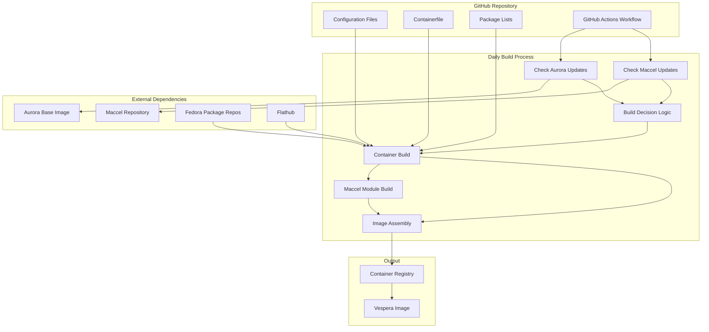

# Design Document

## Overview

The Vespera project creates a custom Fedora Atomic image based on Aurora with package customizations and the maccel mouse acceleration driver. The system uses a containerized build approach with GitHub Actions for automated daily builds that only trigger when upstream changes are detected.

The architecture leverages existing Fedora Atomic tooling (rpm-ostree, Containerfile-based builds) while adding custom package management and kernel module integration. The build system checks for Aurora updates and maccel repository changes before deciding whether to build a new image.

## Architecture

### High-Level Architecture



### Build System Architecture

The build system consists of three main phases:

1. **Change Detection Phase**: Checks upstream sources for updates
2. **Build Phase**: Constructs the custom image with modifications
3. **Publication Phase**: Publishes the image to a container registry

## Components and Interfaces

### 1. Change Detection System

**Purpose**: Determines if a new build is necessary by checking upstream changes.

**Components**:
- Aurora Version Checker: Queries Aurora's container registry for new image tags
- Maccel Update Checker: Monitors the maccel GitHub repository for new commits/releases
- Build Decision Engine: Compares current versions with last successful build

**Interfaces**:
- Input: Previous build metadata (versions, commit hashes)
- Output: Boolean decision to build or skip

### 2. Package Customization System

**Purpose**: Modifies Aurora's package list by removing unwanted packages and adding alternatives.

**Components**:
- Package Removal List: Configuration specifying Aurora packages to exclude
- RPM Addition List: Configuration specifying additional RPM packages
- Flatpak Addition List: Configuration specifying Flatpak applications
- Dependency Resolver: Ensures package changes don't break dependencies

**Interfaces**:
- Input: Base Aurora package manifest, customization configurations
- Output: Modified package manifest for rpm-ostree

### 3. Maccel Integration System

**Purpose**: Builds and integrates the maccel mouse acceleration driver (both kernel module and userspace components).

**Research Notes**: 
- Maccel has both a kernel module component and userspace TUI
- Uses DKMS (Dynamic Kernel Module Support) for kernel module management
- Includes install.sh script for automated setup
- Kernel module provides low-level mouse event interception
- Userspace component provides configuration and control interface
- Requires proper kernel headers and DKMS infrastructure

**Components**:
- Source Fetcher: Clones maccel repository at build time
- Akmods RPM Builder: Creates akmods RPM package for kernel module
- Rust Builder: Compiles userspace TUI binary using Cargo
- RPM Packager: Creates RPM package for userspace binary
- Module Installer: Integrates akmods RPM into package list for rpm-ostree
- Binary Installer: Integrates userspace RPM into package list
- Service Configuration: Sets up systemd service for maccel components

**Interfaces**:
- Input: Maccel source code, kernel headers, akmods infrastructure, Rust toolchain, RPM build tools
- Output: Akmods RPM package, userspace RPM package, systemd services integrated into image

### 4. Container Build System

**Purpose**: Orchestrates the overall image build process using containerized builds.

**Components**:
- Base Image Handler: Pulls and prepares Aurora base image
- Build Orchestrator: Coordinates package customization and maccel integration
- Image Finalizer: Creates final bootable image with proper metadata
- Registry Publisher: Pushes completed image to container registry

**Interfaces**:
- Input: Build configurations, source materials
- Output: Published container image

### 5. GitHub Actions Workflow

**Purpose**: Automates the entire build and publication process.

**Components**:
- Scheduler: Triggers daily workflow execution
- Change Detection Runner: Executes upstream change checks
- Build Runner: Executes container build when changes detected
- Notification System: Reports build status and results

**Interfaces**:
- Input: Repository configurations, secrets for registry access
- Output: Built images, build logs, status notifications

## Data Models

### Build Configuration

```yaml
# vespera-config.yaml
base:
  image: "ghcr.io/ublue-os/aurora"
  
packages:
  remove_rpm:
    - firefox  # Remove Aurora's Firefox RPM package
    - gnome-software  # Remove GNOME Software RPM package
  
  remove_flatpak:
    - org.gnome.Software  # Remove pre-installed GNOME Software Flatpak
    - org.mozilla.Thunderbird  # Remove pre-installed Thunderbird if not wanted
  
  add_rpm:
    - chromium  # Add Chromium as Firefox alternative
    - flatpak  # Ensure Flatpak support
    - maccel  # Custom maccel userspace binary
    - kmod-maccel  # Custom maccel akmods package
  
  add_flatpak:
    - org.mozilla.firefox  # Add Firefox as Flatpak (alternative to removed RPM)
    - com.github.tchx84.Flatseal  # Flatpak permissions manager

maccel:
  repository: "https://github.com/Gnarus-G/maccel"
  service_enabled: true
  config_path: "/etc/maccel/config.toml"
  
build:
  registry: "ghcr.io"
  image_name: "vespera"
  check_interval: "daily"
```

### Build Metadata

```json
{
  "build_id": "20241024-001",
  "timestamp": "2024-10-24T10:30:00Z",
  "base_image": {
    "name": "ghcr.io/ublue-os/aurora",
    "tag": "40-20241024",
    "digest": "sha256:abc123..."
  },
  "maccel": {
    "repository": "https://github.com/Gnarus-G/maccel",
    "commit": "def456...",
    "version": "v1.2.3",
    "binary_path": "/usr/local/bin/maccel",
    "service_enabled": true
  },
  "packages": {
    "removed_rpm": ["firefox", "gnome-software"],
    "removed_flatpak": ["org.gnome.Software"],
    "added_rpm": ["chromium", "flatpak", "maccel", "kmod-maccel"],
    "added_flatpak": ["org.mozilla.firefox", "com.github.tchx84.Flatseal"]
  },
  "image": {
    "registry": "ghcr.io",
    "name": "vespera",
    "tag": "40-20241024",
    "size_mb": 2048
  }
}
```

## Error Handling

### Build Failures

1. **Package Dependency Conflicts**: 
   - Detection: rpm-ostree dependency resolution failures
   - Handling: Fail build with detailed dependency conflict report
   - Recovery: Manual configuration adjustment required

2. **Maccel Build Failures**:
   - Detection: Akmods RPM build errors, Rust compilation errors, or missing dependencies
   - Handling: Retry with updated kernel headers, check akmods setup, verify Rust toolchain
   - Recovery: Verify kernel compatibility, check RPM spec files, update maccel source

3. **Base Image Unavailability**:
   - Detection: Aurora image pull failures
   - Handling: Retry with exponential backoff, use cached image if available
   - Recovery: Wait for Aurora infrastructure recovery

### Runtime Failures

1. **Maccel Module/Service Failures**:
   - Detection: Kernel module loading failures, systemd service start failures, or device access errors
   - Handling: Continue boot without maccel functionality, log detailed warnings
   - Recovery: User can check module compatibility, device permissions, and service configuration

2. **Package Conflicts**:
   - Detection: rpm-ostree transaction failures during updates
   - Handling: Preserve system state, report conflict details
   - Recovery: Manual intervention to resolve conflicts

## Testing Strategy

### Build Testing

1. **Unit Tests**:
   - Change detection logic validation
   - Package list manipulation correctness
   - Configuration parsing accuracy

2. **Integration Tests**:
   - End-to-end build process in test environment
   - Maccel akmods RPM package creation and integration
   - Maccel userspace binary compilation with Rust toolchain
   - Package customization with various Aurora base versions

3. **Automated Testing in CI**:
   - Pull request validation builds
   - Nightly test builds with synthetic changes
   - Regression testing against known good configurations

### Image Testing

1. **Boot Tests**:
   - Automated VM boot testing of generated images
   - Verification of maccel kernel module loading
   - Verification of maccel service startup
   - Package availability validation

2. **Functional Tests**:
   - Maccel kernel module functionality verification
   - Maccel userspace TUI functionality verification
   - Mouse acceleration behavior testing
   - Custom package operation testing
   - Fedora Atomic tooling compatibility

3. **Performance Tests**:
   - Image size optimization validation
   - Boot time measurement
   - Resource usage profiling

### Change Detection Testing

1. **Mock Upstream Changes**:
   - Simulate Aurora updates with test registries
   - Mock maccel repository changes
   - Validate build triggering logic

2. **False Positive Prevention**:
   - Ensure builds don't trigger without real changes
   - Validate version comparison accuracy
   - Test edge cases in change detection

## Maccel Build Requirements

Based on research of the maccel project:

### Dependencies
- akmods (Fedora's kernel module build system)
- Kernel headers for target kernel version
- Build tools (gcc, make, etc.)
- RPM build tools (rpmbuild, rpmdev-setuptree)
- Rust toolchain (cargo, rustc) for userspace component
- libevdev development headers (if needed for userspace)

### Build Process
1. Clone maccel repository
2. Create akmods RPM spec file for maccel kernel module
3. Install akmods and kernel development packages in build container
4. Install Rust toolchain in build container
5. Build akmods RPM package containing maccel kernel module source
6. Build userspace TUI component with Cargo
7. Create RPM package for userspace maccel binary
8. Add both RPMs to package customization list
9. Configure systemd services for maccel components

### Runtime Requirements
- Pre-built kernel module integrated into image
- Kernel module loading capabilities
- Access to `/dev/input/` devices
- Proper module loading permissions
- systemd for service management

### Akmods Integration for Immutable OS
- Fedora Atomic uses akmods instead of DKMS for kernel modules
- Create akmods RPM package for maccel during build process
- Akmods builds kernel modules during rpm-ostree compose
- Module gets integrated into the immutable image at build time
- No runtime module compilation needed on target systems

### Service Configuration
- systemd service for kernel module loading
- systemd service for userspace TUI component
- Automatic startup configuration
- Proper device permissions and module loading

## Implementation Considerations

### Security

- Use minimal base images and remove unnecessary packages
- Implement secure credential handling for registry access
- Validate all external source integrity (checksums, signatures)
- Regular security scanning of built images

### Performance

- Implement build caching to reduce build times
- Use multi-stage builds to minimize final image size
- Optimize package installation order for faster builds
- Implement parallel processing where possible

### Maintainability

- Clear separation of concerns between components
- Comprehensive logging for troubleshooting
- Version pinning for reproducible builds
- Documentation for configuration and customization

### Scalability

- Design for multiple architecture support (x86_64, aarch64)
- Support for multiple base image variants
- Configurable build frequency and triggers
- Extensible package customization system